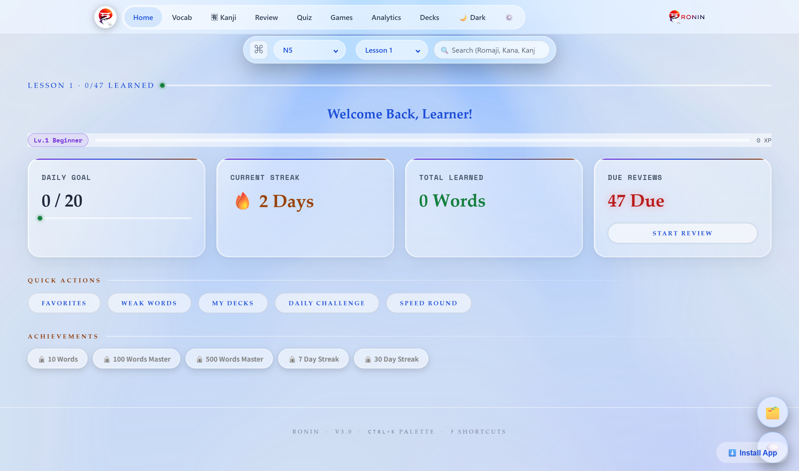
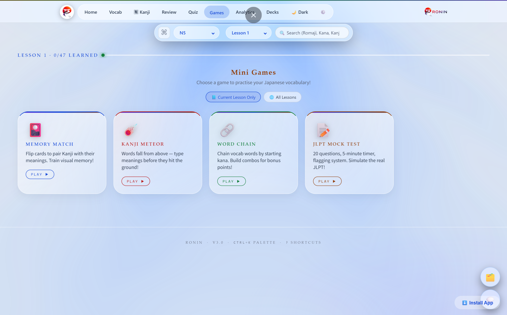
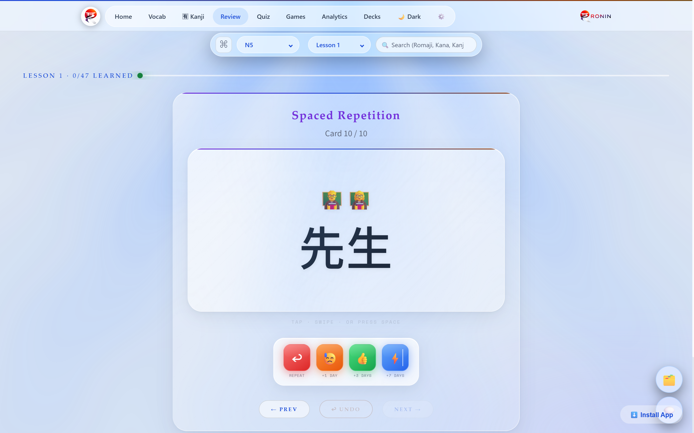

<div align="center">

# 🎌 JLPT N5–N4 Vocabulary Trainer

### A Modern Progressive Web Application (PWA) for Learning Japanese Vocabulary

Master Japanese vocabulary through **Spaced Repetition**, **Interactive Flashcards**, **Gamified Learning**, **Quizzes**, **Analytics**, and **Offline Study** — all built using **Vanilla HTML, CSS and JavaScript**.

[Live Demo](https://rahulsahu1221.github.io/JLPT-Vocabulary-Trainer/) •
[Report Bug](../../issues) •
[Request Feature](../../issues)

</div>

---

# 📖 Overview

Learning Japanese vocabulary often becomes repetitive and difficult to maintain over time. Most learning applications either focus only on flashcards or quizzes and provide little insight into learning progress.

The **JLPT N5–N4 Vocabulary Trainer** is a feature-rich Progressive Web Application (PWA) designed to make vocabulary learning engaging, interactive, and efficient.

The application combines **Spaced Repetition System (SRS)**, **interactive quizzes**, **educational games**, **custom vocabulary decks**, **progress analytics**, and **offline accessibility** into one lightweight web application.

---

# ✨ Key Features

## 📚 Vocabulary Learning

- JLPT N5 and N4 vocabulary
- Kanji
- Hiragana
- English meanings
- Memory tips
- Example sentences
- Emoji categorization

---

## 🧠 Spaced Repetition System (SRS)

- Intelligent review scheduling
- Memory strength tracking
- Due review reminders
- Learning intervals
- Weak word identification

---

## ⚡ Interactive Quiz System

- Multiple quiz modes
- Randomized questions
- Instant feedback
- Score calculation
- Performance analysis

---

## 🎮 Educational Games

Learning through games including

- Memory Matching
- Meteor Game
- Shiritori
- Mock Test
- Speed Round

---

## 📊 Dashboard Analytics

- Learning progress
- Daily statistics
- Heatmap
- XP System
- Level progression
- JLPT readiness estimation
- Review statistics

---

## 🗂 Custom Decks

- Create personal decks
- Organize vocabulary
- Favorite words
- Weak words
- Learned words

---

## 🔎 Smart Search

Search using

- Kanji
- Hiragana
- Romaji
- English
- Dictionary lookup

---

## 🌐 Progressive Web App (PWA)

- Installable application
- Offline support
- Service Worker
- Local storage
- Mobile friendly
- Desktop support

---

# 📷 Screenshots

> Replace these placeholders with actual screenshots.

| Dashboard | Vocabulary |
|------------|------------|
|  |  |

| Quiz | Games |
|------|------|
|  |  |

| Analytics | Review |
|-----------|---------|
|  |  |

---

# 🚀 Live Demo

## GitHub Pages

https://rahulsahu1221.github.io/JLPT-Vocabulary-Trainer/

---

# 🏗 Project Architecture

```
JLPT Trainer
│
├── Dashboard
│
├── Vocabulary
│      │
│      ├── Flashcards
│      ├── Favorites
│      ├── Learned
│      ├── Weak Words
│      └── Custom Decks
│
├── Review (SRS)
│
├── Quiz
│
├── Games
│      ├── Memory Match
│      ├── Meteor
│      ├── Shiritori
│      ├── Mock Test
│      └── Speed Round
│
├── Analytics
│
└── Settings
```

---

# ⚙ Technologies Used

| Technology | Purpose |
|------------|----------|
| HTML5 | Structure |
| CSS3 | Styling |
| JavaScript (ES6+) | Application Logic |
| Local Storage | Persistent Data |
| Service Worker | Offline Support |
| Web App Manifest | Installable PWA |
| Web Speech API | Pronunciation |
| WebGL | Animated Background |

---

# 📂 Project Structure

```
JLPT-Vocabulary-Trainer/

│
├── index.html
├── style.css
├── app.js
├── decks.js
├── games.js
├── sw.js
├── manifest.json
│
├── data/
│      ├── lesson1.json
│      ├── lesson2.json
│      ├── ...
│      ├── lesson50.json
│      └── assets/
│
├── images/
│
└── README.md
```

---

# 🎯 Major Functionalities

✅ Vocabulary Flashcards

✅ JLPT Lessons

✅ Interactive Search

✅ Smart Filtering

✅ Spaced Repetition

✅ Quiz Engine

✅ Educational Games

✅ Dashboard Analytics

✅ XP & Level System

✅ Heatmap

✅ JLPT Readiness

✅ Daily Challenges

✅ Offline Mode

✅ Dark / Light Theme

✅ Mobile Responsive

---

# 🧠 Spaced Repetition Algorithm

The application schedules future reviews according to user performance.

```
Correct Answer

↓

Increase Interval

↓

Schedule Future Review

↓

Strengthen Memory

↓

Reduce Future Reviews
```

Incorrect answers shorten the review interval so difficult words appear more frequently.

---

# 🎮 Gamification

The application motivates learning through

- XP rewards
- Levels
- Daily Challenges
- Heatmap
- Review streaks
- Speed Rounds
- Achievements

---

# 📊 Performance Tracking

Users can monitor

- Total Learned Words
- Words Remaining
- Weak Vocabulary
- Review Queue
- XP Progress
- Daily Activity
- JLPT Readiness
- Quiz Performance

---

# 📱 Progressive Web App Features

- Install on Android
- Install on Desktop
- Offline Learning
- Cached Lessons
- Fast Loading
- Native-like Experience

---

# 🔒 Security

The application follows several security-focused practices:

- Content Security Policy (CSP)
- HTML sanitization
- Safe attribute escaping
- Trusted origin checks
- No use of `eval`
- Secure local storage handling

---

# 🚀 Future Improvements

- JLPT N3 Vocabulary
- User Accounts
- Cloud Synchronization
- AI-based Learning Recommendations
- Voice Recognition Practice
- Writing Practice
- Kanji Stroke Animations
- Leaderboards
- Multi-language Support

---

# 🎓 Learning Outcomes

Developing this project strengthened my knowledge in:

- Frontend Web Development
- Progressive Web Applications (PWA)
- JavaScript ES6+
- DOM Manipulation
- Browser APIs
- Service Workers
- Local Storage
- Responsive UI Design
- Gamification
- Spaced Repetition Algorithms
- Performance Optimization

---

# 👨‍💻 Author

## Rahul Sahu

**Bachelor of Technology (Electrical & Electronics Engineering)**

Interested in

- Embedded Systems
- IoT
- Web Development
- Human–Computer Interaction
- Japanese Technology

---

# ⭐ Support

If you found this project useful,

⭐ Star this repository.

It helps others discover the project.

---

## 📜 License

This project is licensed under the MIT License.
